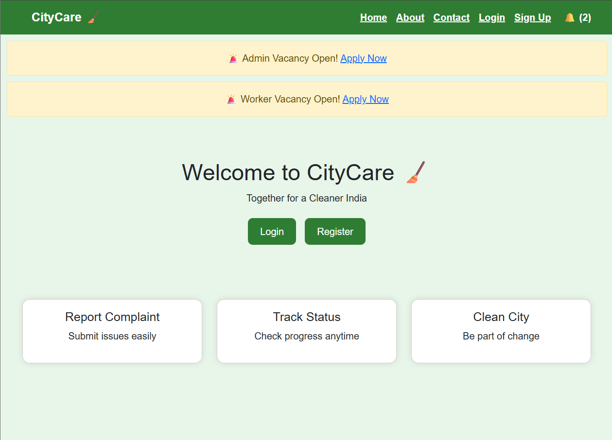
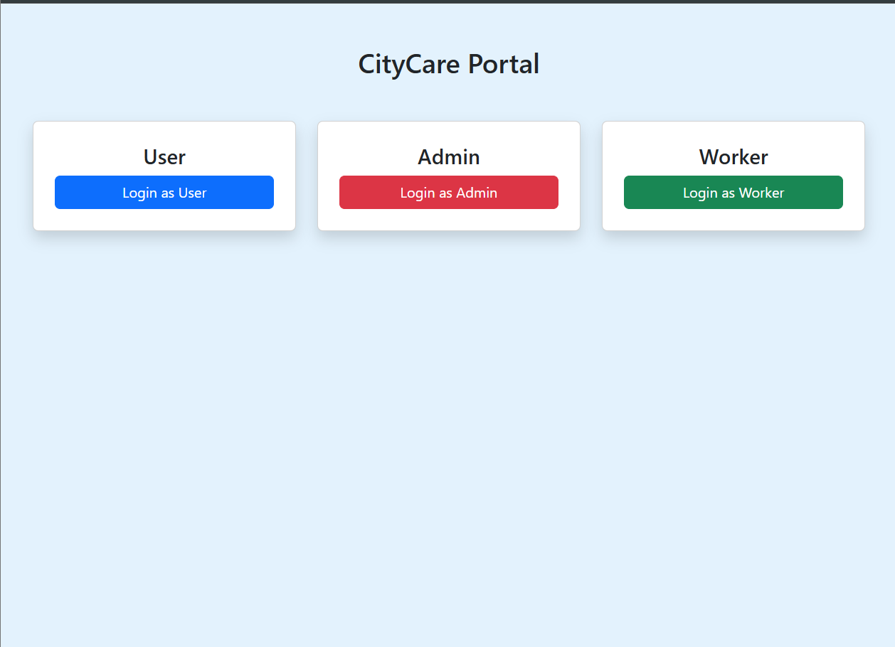
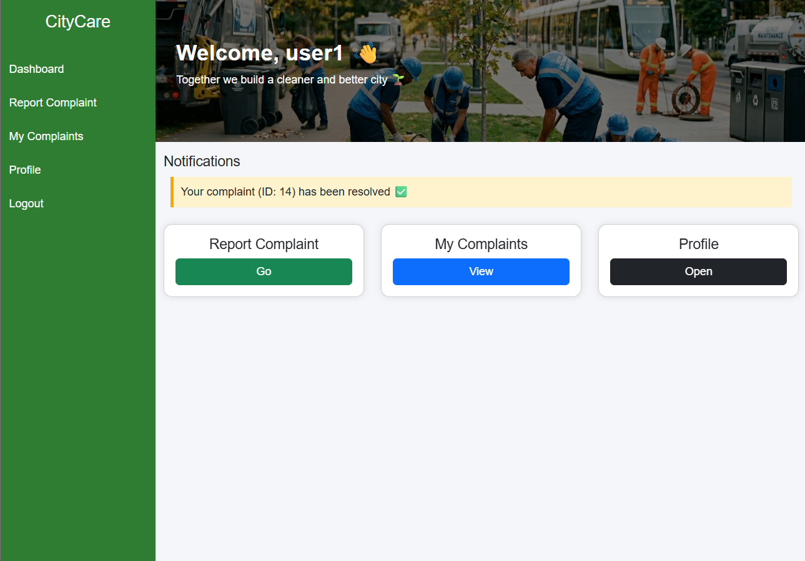
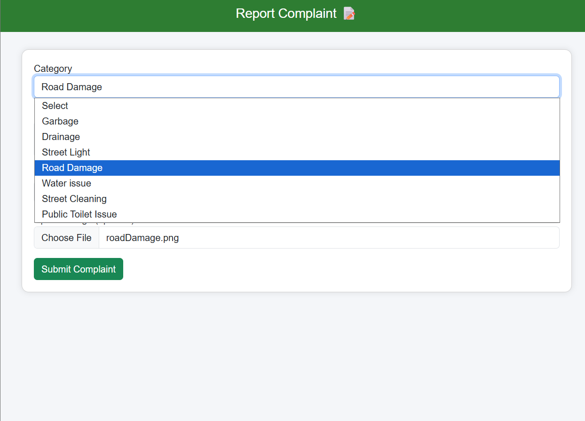
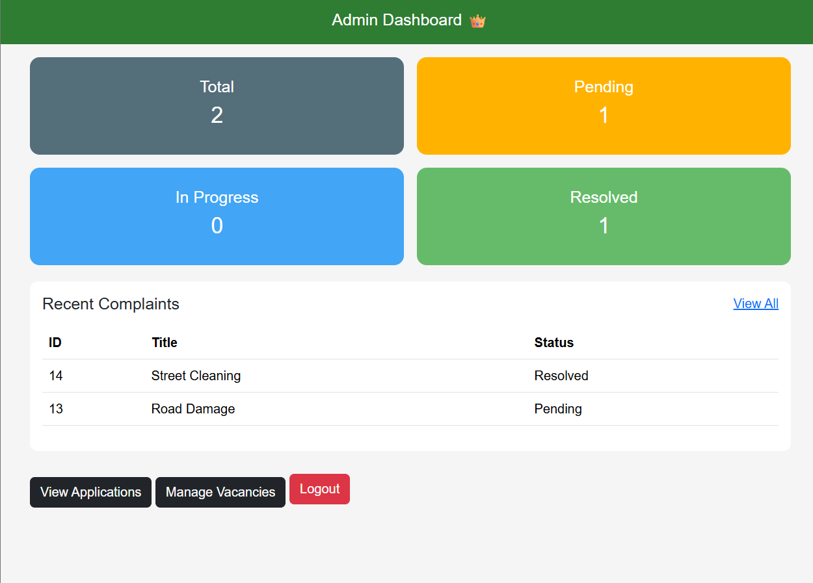
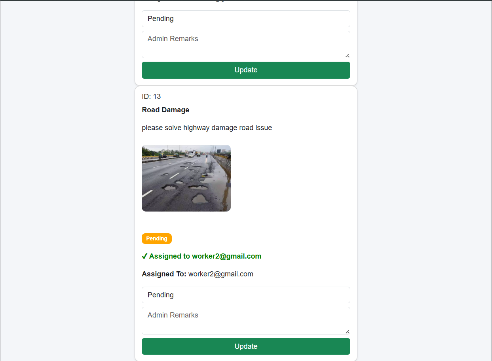
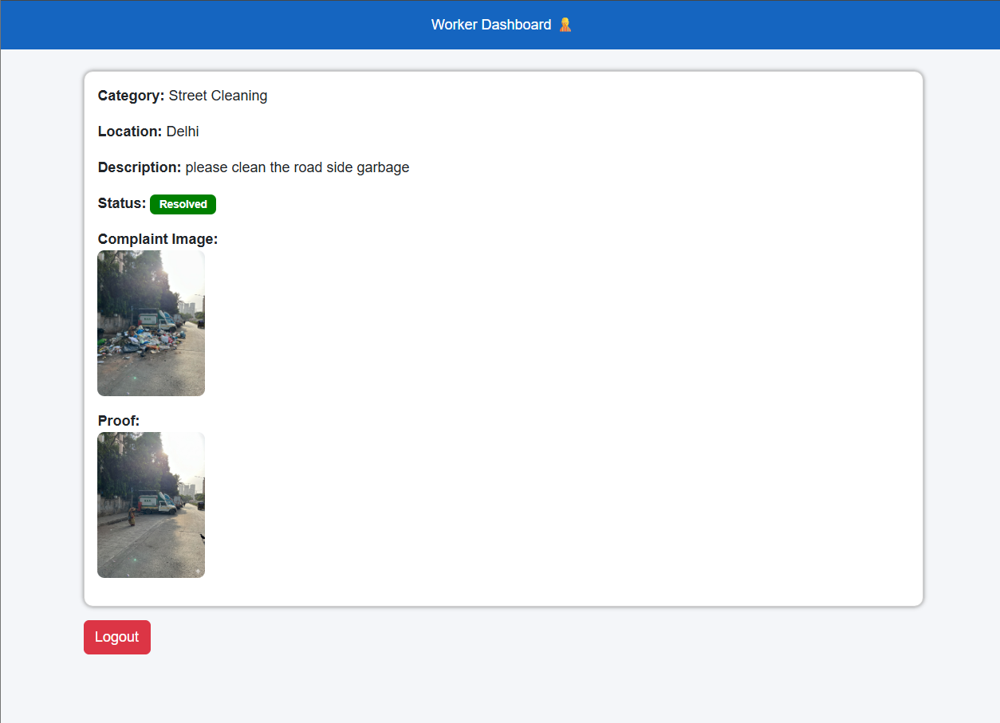
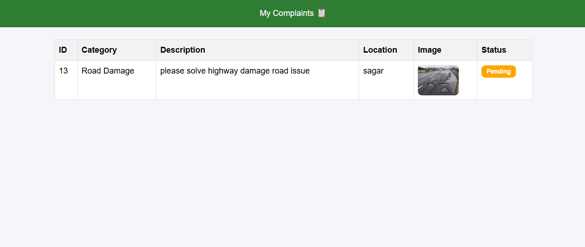

# CityCare
CityCare is a web-based complaint management system . It allows citizens to report civic issues, while administrators can assign tasks to workers and monitor progress. The system includes role-based access (User, Admin, Worker), real-time complaint status tracking, and a vacancy application feature for recruitment.

---

## Overview

CityCare is a full-stack web application designed to help citizens report civic issues such as garbage, road damage, water leakage, etc. The system ensures proper management of complaints through role-based access for Users, Workers, and Admin.

---

## Objective

* Provide an easy platform for users to report issues
* Allow admin to manage and assign work efficiently
* Enable workers to resolve complaints with proof
* Maintain transparency through status tracking and notifications

---

## User Roles & Features

### User

* Register & Login
* Report complaint with category, description, location, and image
* View submitted complaints
* Track complaint status (Pending / In Progress / Resolved)
* Receive notifications when issue is resolved

---

### Worker

* Secure login access
* View only assigned complaints
* Update complaint status
* Upload proof image after completing work

---

### Admin

* Secure admin login
* View all complaints
* Assign complaints to workers
* Update complaint status and add remarks
* Manage user applications (Approve / Reject)
* Manage vacancies (Open / Close / Delete)
* Send notifications to users

---

## Key Features

* Role-based authentication system
* Complaint submission with image upload
* Worker assignment system
* Real-time status tracking
* Notification system for users
* Vacancy management & application system
* Admin dashboard with full control
* Responsive UI (Mobile-friendly)

---

## Project Structure

```
CityCare/
│
├── admin/
├── user/
├── worker/
├── config/
├── assets/
│   └── images/
|   └── screenshots/
│
├── index.php
├── login.php
├── register.php
├── logout.php
├── apply.php
├── apply_process.php
├── about.php
├── contact.php
├── citycare.sql
```

---

## Tech Stack

* Frontend: HTML, CSS, Bootstrap
* Backend: PHP
* Database: MySQL
* Server: XAMPP (Apache + MySQL)

---

## Installation & Setup

1. Clone or download the project
2. Move project folder to:

   ```
   xampp/htdocs/
   ```
3. Start Apache & MySQL in XAMPP
4. Open phpMyAdmin
5. Create a database (e.g., `citycare`)
6. Import the file:

   ```
   citycare.sql
   ```
7. Open browser and run:

   ```
   http://localhost/CityCare
   ```

---

## System Workflow

User → Submit Complaint
→ Admin reviews & assigns worker
→ Worker resolves issue + uploads proof
→ Status updated to "Resolved"
→ User receives notification

---

## Future Enhancements

* Password encryption (security improvement)
* Email notifications
* Real-time updates
* Complaint filtering & search
* Data analytics using Python
* Map integration for location tracking

---

## Project Status

Version 1.0 – Core features completed
Further improvements planned

---

## Author

Somi, Developed as a BCA Final Year Project

---

## License

This project is for educational purposes only.

## 📸 Screenshots

### 🏠 Home Page



### 🔐 Login Page



### 👤 User Dashboard



### 📝 Report Complaint



### 👑 Admin Dashboard



### 📋 Manage Complaints



### 👷 Worker Dashboard



### 📊 User Check My Complaints



